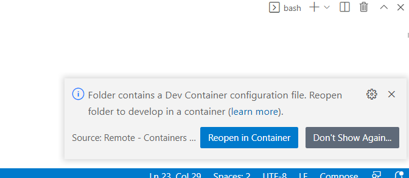
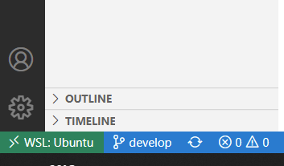
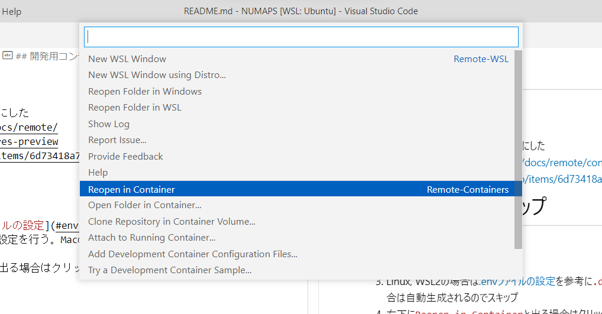
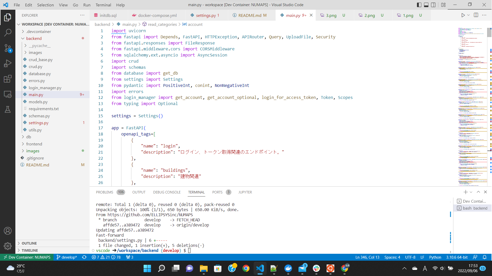
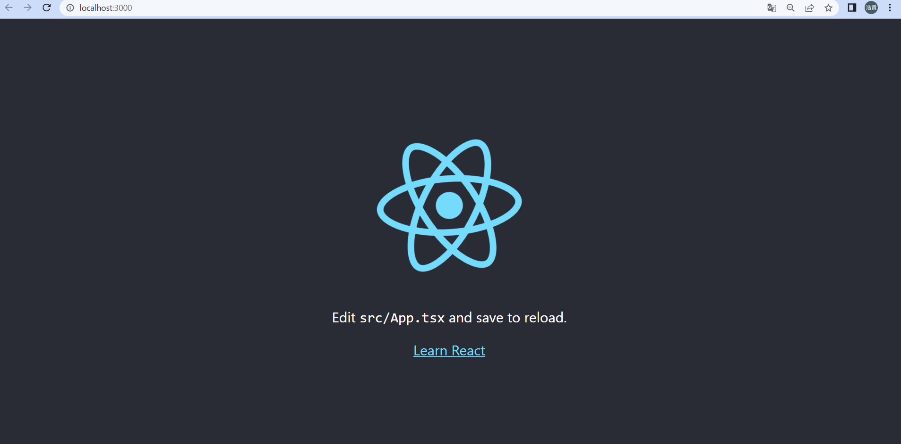

# React Training
- React練習用の開発用コンテナ

# 開発環境のセットアップ
1. git clone
1. VS Codeで開く
1. 右下に`Reopen in Container`と出る場合はクリックして4, 5はスキップ  

1. 左下の緑色の部分をクリック  

1. `Reopen in Container`をクリック→OK  

1. しばらく待つと開発用コンテナが起動する  

1. 次回以降は`Open Recent`からも起動できる

# React App起動
- `frontend`のディレクトリで`yarn`を実行すると`frontend/package.json`の情報をもとに必要なパッケージがコンテナ内にインストールされる
- `yarn start`でReact Appが起動してブラウザ上で`http://localhost:3000`が勝手に開く
```
cd frontend
yarn
yarn start
```
### 実行結果

- `frontend/src/App.tsx`の中を変更するとページを書き換えられる
- 下記はReact公式のTutorialであるがこの中のクラスコンポーネントは現在はあまり使われないので無視  
https://ja.reactjs.org/tutorial/tutorial.html
- 代わりに`React hooks` (関数コンポーネント)を使う  
https://ja.reactjs.org/docs/hooks-intro.html
- 上記の例を`App.tsx`に組み込む場合は下記のように書き換える
```
import React, { useState } from 'react';

function App() {
  return (
    <Example />
  );
}

function Example() {
  // Declare a new state variable, which we'll call "count"
  const [count, setCount] = useState(0);

  return (
    <div>
      <p>You clicked {count} times</p>
      <button onClick={() => setCount(count + 1)}>
        Click me
      </button>
    </div>
  );
}

export default App;
```
- この環境では`TypeScript`を用いている    
https://typescript-jp.gitbook.io/deep-dive/
- `JavaScript`に型を導入することでバグを抑制するだけでなく、VS Codeの自動補完によって生産性を向上させることができる
- `yarn start`での実行時に`JavaScript`に変換(トランスコンパイル)される
- コンパイル時に`JavaScript`のバージョンの違いを吸収してくれるので実行環境の違いなどをほとんど考慮しなくてよい
- 型はコンパイル時の型チェックに用いられるだけなので、コンパイル後の`JavaScript`のプログラム動作には全く影響しない
- 型についてよくわからない場合はすべて`any`にしておけば`JavaScript`と全く同じようにコードを書くことができる  
https://typescriptbook.jp/reference/values-types-variables/any


# Pythonの実行
- `backend`ディレクトリの`main.py`を実行すると`hello world`と表示される
```
cd backend
python main.py
```
### 実行結果
```
vscode ➜ /workspace/backend (main ✗) $ python main.py 
hello world
```
