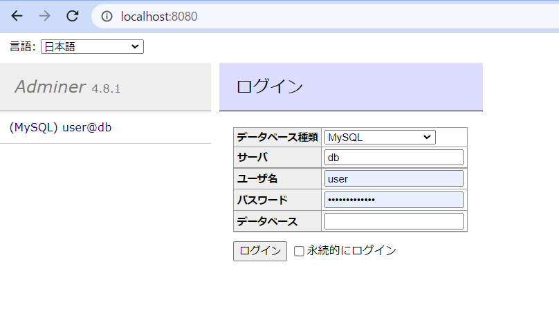

# Fast API Example with MariaDB & SQLAlchemy (Async IO ver.)
This example based on https://fastapi.tiangolo.com/ja/tutorial/sql-databases/

# How to Run
```
cd examples/sql_app_mariadb
python main.py
```

# How to Access OpenAPI (Swagger)
- Access http://localhost:8000/docs after starting up the server.

# How to Access Adminer
- Access http://localhost:8080.
```
Server: db
User: user # See ".devcontainer/.env" file
Pass: user_password # See ".devcontainer/.env" file
```


